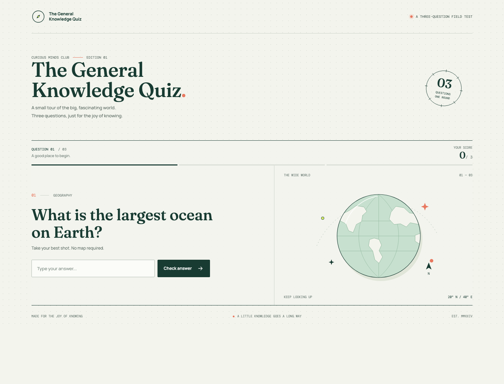

# The General Knowledge Quiz

## 1. Project Title

The General Knowledge Quiz

## 2. Aim

Create a short interactive quiz that practices Python input, string sanitization, conditional logic, score tracking, and formatted output.

## 3. Problem Statement

Ask the user three general knowledge questions. Compare each sanitized answer with its correct answer, report whether it is correct, and reveal the correct answer when it is not. At the end, display the score out of three and feedback based on the result.

## 4. Algorithm

1. Initialize `score` to `0`.
2. For each question:
   - Ask for an answer and capture it.
   - Remove leading and trailing whitespace and convert the answer to lowercase.
   - Compare the sanitized answer with the expected answer using `==`.
   - If it matches, print `Correct!` and add one to `score`.
   - Otherwise, print `Incorrect!` and show the correct answer.
3. Display the final score out of three with an f-string.
4. Select and display performance feedback for the score.

## 5. Flowchart (ASCII/Text Flowchart)

```text
                 +----------------+
                 | Start: score=0 |
                 +-------+--------+
                         |
                         v
            +--------------------------+
            | Ask, capture, sanitize Q1 |
            +------------+-------------+
                         |
                         v
                 +---------------+
                 | Q1 correct?   |
                 +---+-------+---+
                   Yes       No
                    |         |
             +------+--+  +---+-----------------+
             | Print   |  | Print incorrect and |
             | correct |  | reveal answer       |
             | score++ |  +----------+----------+
             +----+----+             |
                  +---------+---------+
                            |
                            v
            +--------------------------+
            | Ask, capture, sanitize Q2 |
            +------------+-------------+
                         |
                         v
                 +---------------+
                 | Q2 correct?   |
                 +---+-------+---+
                   Yes       No
                    |         |
             +------+--+  +---+-----------------+
             | Print   |  | Print incorrect and |
             | correct |  | reveal answer       |
             | score++ |  +----------+----------+
             +----+----+             |
                  +---------+---------+
                            |
                            v
            +--------------------------+
            | Ask, capture, sanitize Q3 |
            +------------+-------------+
                         |
                         v
                 +---------------+
                 | Q3 correct?   |
                 +---+-------+---+
                   Yes       No
                    |         |
             +------+--+  +---+-----------------+
             | Print   |  | Print incorrect and |
             | correct |  | reveal answer       |
             | score++ |  +----------+----------+
             +----+----+             |
                  +---------+---------+
                            |
                            v
              +-------------------------+
              | Display score and       |
              | performance feedback   |
              +------------+------------+
                           |
                           v
                    +-------------+
                    |     End     |
                    +-------------+
```

## 6. Complete Python Code

```python
"""A short, interactive general knowledge quiz."""

# Storage: keep track of the number of correct answers.
score = 0

# Question 1 - Ask & Capture, then Sanitize.
answer_1 = input("1. What is the largest ocean on Earth? ").strip().lower()

# Evaluate the sanitized answer and Execute the matching result.
if answer_1 == "pacific ocean":
    print("Correct!")
    score += 1
else:
    print("Incorrect!")
    print("Correct answer: Pacific Ocean")

# Question 2 - Ask & Capture, then Sanitize.
answer_2 = input("2. What is the capital of France? ").strip().lower()

# Evaluate the sanitized answer and Execute the matching result.
if answer_2 == "paris":
    print("Correct!")
    score += 1
else:
    print("Incorrect!")
    print("Correct answer: Paris")

# Question 3 - Ask & Capture, then Sanitize.
answer_3 = input("3. Which planet is known as the Red Planet? ").strip().lower()

# Evaluate the sanitized answer and Execute the matching result.
if answer_3 == "mars":
    print("Correct!")
    score += 1
else:
    print("Incorrect!")
    print("Correct answer: Mars")

# Output the final score and feedback for the user's performance.
print(f"Final score: {score}/3")

if score == 3:
    feedback = "Excellent"
elif score == 2:
    feedback = "Good Job"
elif score == 1:
    feedback = "Keep Practicing"
else:
    feedback = "Try Again"

print(f"Performance: {feedback}")
```

## 7. Line-by-Line Explanation

- The module docstring describes the program.
- `score = 0` initializes the score before any questions are answered.
- Each `input(...).strip().lower()` asks a question, stores the answer, removes extra spaces at either end, and converts letters to lowercase.
- Each `if answer_n == ...` compares the normalized answer with the expected answer using exact equality.
- The `if` branch prints `Correct!` and increments the score with `score += 1`.
- The `else` branch prints `Incorrect!` and displays the correct answer without changing the score.
- `print(f"Final score: {score}/3")` uses an f-string to insert the score in the result.
- The feedback conditions select the matching message for scores from zero through three.
- The final f-string displays the selected feedback.

Every question follows the same Question Block Architecture: Ask & Capture and Sanitize happen on the input line; Evaluate is the `if` comparison; Execute is the corresponding `if` or `else` body.

## 8. Dry Run Table

Example answers: `  PACIFIC OCEAN  `, `Paris`, `venus`.

| Question | Entered answer | Sanitized answer | Comparison | Result | Score |
|---|---|---|---|---|---:|
| 1 | `  PACIFIC OCEAN  ` | `pacific ocean` | Matches `pacific ocean` | Correct | 1 |
| 2 | `Paris` | `paris` | Matches `paris` | Correct | 2 |
| 3 | `venus` | `venus` | Does not match `mars` | Incorrect; reveals Mars | 2 |
| Final | - | - | Score is 2/3 | Good Job | 2 |

## 9. Sample Input and Output

```text
1. What is the largest ocean on Earth?   PACIFIC OCEAN
Correct!
2. What is the capital of France? Paris
Correct!
3. Which planet is known as the Red Planet? Venus
Incorrect!
Correct answer: Mars
Final score: 2/3
Performance: Good Job
```

The question text and answer are on the same line in a terminal because `input()` displays its prompt without ending the line.

## Quiz Interface



## 10. Learning Outcomes

- Read text from a user with `input()`.
- Normalize text with `.strip()` and `.lower()` so case and extra outer spaces do not affect answers.
- Compare strings using `==` and choose a branch with `if` and `else`.
- Track a running total with a variable and `score += 1`.
- Display calculated values in f-strings.
- Identify the Input, Process, Storage, and Output parts of a small program.

## 11. Conclusion

The quiz uses the IPOS model: **Input** is the user's answers; **Process** is sanitization and comparison; **Storage** is the `score` variable; and **Output** is the correctness messages, revealed answers, final score, and performance feedback. Run `python3 main.py` from this project directory to play.# General-Knowledge-Quiz
